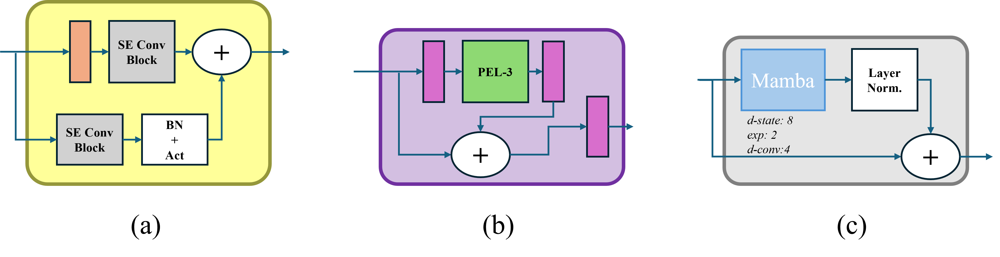

# UPEN-Mamba
Welcome to the official repository for **U-PEN Mamba**, a cutting-edge deep learning model introduced in the paper *"Efficient Retinal Image Segmentation Using Progressively Expanded Neuron and Self-Attention"*. This project presents a family of U-Net-based architectures—U-PEN, U-PEN++, and U-PEN Mamba—designed for high-accuracy, parameter-efficient retinal vessel segmentation in medical imaging.


<p align="center">
  <figure>
    
    <figcaption>Illustration of the U-PEN Mamba architecture.</figcaption>
  </figure>
</p>

<p align="center">
  <figure>
    
    <figcaption>Illustration of the U-PEN Mamba's blocks: (a) the STEM block, (b) The Convolution Progressive Expansion with Attention Block, and (c) The Mamba Global Context (MGC) block.</figcaption>
  </figure>
</p>


## Paper Summary

The paper advances medical image segmentation by introducing three novel architectures:
- **U-PEN**: Integrates Progressive Expansion Layers (PEL) into U-Net’s encoder, reducing memory usage and trainable parameters.
- **U-PEN++**: Enhances U-PEN with a Progressively Expanded Neuron with Attention (PEN-A) module, incorporating multi-head attention for improved contextual feature capture.
- **U-PEN Mamba**: Combines PEL with Mamba’s selective state-space models (SSMs), achieving state-of-the-art performance with optimized efficiency.

Evaluated on the **DRIVE DB** and **CHASE DB1** datasets, U-PEN Mamba achieves top mIoU (0.8394 CHASE, 0.8221 DRIVE) and competitive Dice Coefficients (0.8187 CHASE, 0.8078 DRIVE), outperforming U-Net, ResUNet, TransUNet, and U-Mamba. U-PEN++ offers exceptional parameter efficiency at 4.5M parameters, while U-PEN Mamba balances accuracy and scalability at 21.6M parameters. The architectures leverage nonlinear feature expansion and advanced attention/state-space mechanisms to enhance segmentation precision and computational efficiency.

For full details, refer to the paper (link to be added upon publication).

## Repository Structure
```
U-PEN-Mamba/
├── data/                # Directory for datasets (DRIVE DB, CHASE DB1)
├── models/              # U-PEN Mamba model implementation
├── scripts/             # Training, prediction, and evaluation scripts
│   ├── train.py         # Script to train the model
│   ├── predict.py       # Script for inference on new images
│   └── evaluate.py      # Script to evaluate model performance
├── requirements.txt     # Required Python packages
├── README.md            # This file
└── LICENSE              # License file (e.g., MIT)
```


## Prerequisites

- **Python**: 3.8 or higher
- **Hardware**: NVIDIA GPU (e.g., Tesla A100) recommended for training
- **Datasets**: DRIVE DB and CHASE DB1 (download from [DRIVE](https://drive.grand-challenge.org/) and [CHASE DB1](https://blogs.kingston.ac.uk/retinal/chasedb1/))

## Installation

1. **Clone the Repository**:
   ```bash
   git clone https://github.com/yourusername/U-PEN-Mamba.git
   cd U-PEN-Mamba

```
data/
├── DRIVE/
│   ├── training/
│   └── test/
├── CHASE_DB1/
│   ├── images/
│   └── groundtruth/
```


## Licence
[](https://opensource.org/licenses/MIT)

